# Emoticons in msnchat-rs

Welcome to the `msnchat-rs` Emoticon Reference! 

Emoticons bring your chat messages to life! Hailing from an era before modern emojis even existed, these classic icons are a blast from the past. Whenever you type one of the key combinations listed below into the chat edit control, it will automatically be parsed and replaced with its corresponding graphical icon. 

Whether you're happy `:)`, sad `:(`, or just feeling a bit silly `:P`, we've got an emoticon for every occasion. Simply type the key combination exactly as shown (they are case-sensitive where appropriate), and `msnchat-rs` will do the rest.

Happy chatting!

| Emoticon | Key Combinations | Description |
|---|---|---|
|  | `:)` or `:-)` | Smile |
| 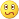 | `:S`, `:s`, `:-S` or `:-s` | Confused |
| 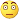 | `:\|` or `:-\|` | Disappointed |
| 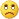 | `:(`, `:-(`, `:<` or `:-<` | Sad |
|  | `:D`, `:d`, `:-D`, `:-d`, `:>` or `:->` | Open-mouthed |
| 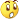 | `:-O`, `:-o`, `:O` or `:o` | Surprised |
| 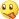 | `:P`, `:p`, `:-P` or `:-p` | Tongue out |
| 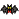 | `:[` or `:-[` | Vampire bat |
| 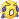 | `:'(` | Crying |
| 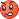 | `:@` or `:-@` | Angry |
| 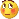 | `:$` or `:-$` | Embarrassed |
| 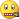 | `:-#` | Don't tell anyone |
| 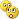 | `:-*` | Secret telling
| 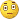 | `:^)` | I don't know |
|  | `(A)` or `(a)` | Angel |
| 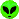 | `(al)` | Alien |
| 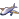 | `(ap)` | Airplane |
| 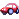 | `(au)` | Auto |
| 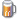 | `(B)` or `(b)` | Beer mug |
| 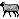 | `(bah)` | Black sheep |
| 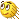 | `(brb)` | Be right back |
|  | `(C)` or `(c)` | Coffee cup |
| 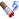 | `(ci)` | Cigarette |
| 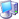 | `(co)` | Computer |
| 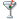 | `(D)` or `(d)` | Martini glass |
|  | `(E)` or `(e)` | E-mail |
| 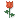 | `(F)` or `(f)` | Red rose |
|  | `(G)` or `(g)` | Gift with bow |
|  | `(H)` or `(h)` | Hot |
|  | `(h5)` | High five! |
| 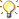 | `(I)` or `(i)` | Light bulb |
| 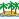 | `(ip)` | Island with a palm tree |
|  | `(K)` or `(k)` | Red lips |
| 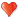 | `(L)` or `(l)` | Red heart |
| 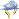 | `(li)` | Lightning |
| 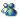 | `(M)` or `(m)` | MSN Messenger icon |
| 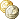 | `(mo)` | Money |
| 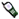 | `(mp)` | Mobile phone |
|  | `(N)` or `(n)` | Thumbs down |
|  | `(O)`, `(o)` or `(0)` | Clock |
|  | `(P)` or `(p)` | Camera |
| 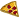 | `(pi)` | Pizza |
|  | `(pl)` | Plate |
|  | `(S)` | Sleeping half-moon |
| 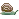 | `(sn)` | Snail |
| 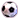 | `(so)` | Soccer ball |
| 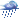 | `(st)` | Stormy cloud |
|  | `(R)` or `(r)` | Rainbow* |
| 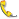 | `(T)` or `(t)` | Telephone receiver |
| 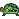 | `(tu)` | Turtle |
| 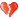 | `(U)` or `(u)` | Broken heart |
| 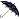 | `(um)` | Umbrella |
| 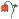 | `(W)` or `(w)` | Wilted rose |
| 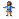 | `(X)` or `(x)` | Girl |
| 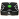 | `(xx)` | Xbox |
|  | `(Y)` or `(y)` | Thumbs up |
| 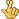 | `(yn)` | Fingers crossed |
| 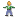 | `(Z)` or `(z)` | Boy |
| 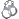 | `(%)` | Handcuffs |
| 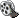 | `(~)` | Filmstrip |
|  | `(*)` | Star |
|  | `(8)` | Note |
| 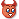 | `(6)` | Devil |
| 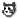 | `(@)` | Cat face |
| 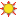 | `(#)` | Sun* |
| 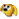 | `(&)` | Dog face |
| 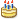 | `(^)` | Birthday cake |
| 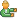 | `({)` | Left hug |
|  | `(})` | Right hug |
|  | `(?)` | Age/sex/location? |
|  | `(\|\|)` | Bowl |
|  | `*-)` | Thinking |
|  | `+o(` | Sick |
|  | `8o\|` | Baring teeth
|  | `8-)` | Eye-rolling |
|  | `8-\|` | Nerd |
|  | `;)` or `;-)` | Wink |
|  | `<:o)` | Party |
|  | `\|-)` | Sleepy |
|  | `^o)` | Sarcastic |
