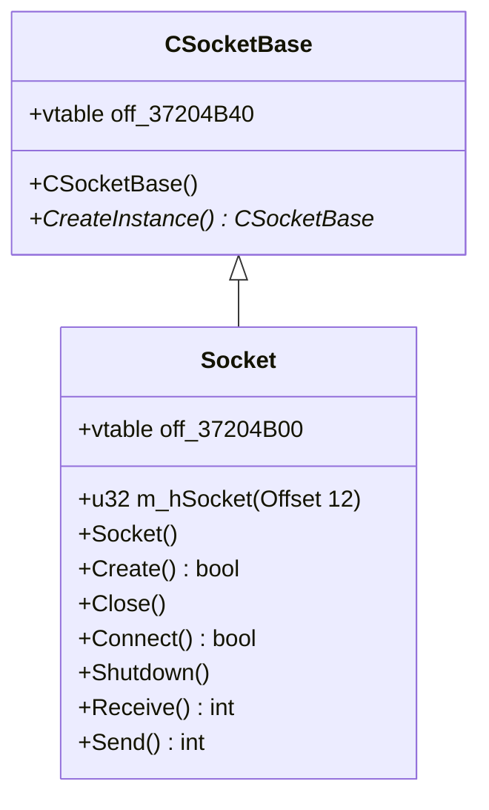

# WSOCK32 Import & Async Network Architecture Mapping

This document maps all imports from `WSOCK32.dll` used by `MsnChat45.ocx`, detailing which internal functions call them, their associated vtables, their purposes, and how we completely replaced the native Winsock network pipeline with a clean, concurrent Rust/Tokio backend.

---

## 1. Socket Manager Class Vtable (`off_37204AD4`)

The Socket Manager coordinates asynchronous, multiplexed network communication across multiple connections. In the original `MsnChat45.ocx` implementation, it is represented by a C++ class whose vtable is located at `0x37204AD4` (disassembled as `off_37204AD4`).

The constructor `sub_37232AEE` and destructor `sub_37232B53` bind/unbind this virtual table.

### `SocketManager` Virtual Methods Vtable Mapping

| Vtable Offset | Function Symbol | Address | Purpose | Description |
| :--- | :--- | :--- | :--- | :--- |
| `+0x00` (Offset 0) | `sub_37232E22` | `0x37232e22` | Destructor Helper | Performs virtual destruction / cleanup of manager structures. |
| `+0x04` (Offset 1) | `sub_3721440B` | `0x3721440b` | Inherited / Dummy | Placeholder virtual method. |
| `+0x08` (Offset 2) | `sub_37214416` | `0x37214416` | Inherited / Dummy | Placeholder virtual method. |
| `+0x0C` (Offset 3) | `sub_37214435` | `0x37214435` | Inherited / Dummy | Placeholder virtual method. |
| `+0x10` (Offset 4) | `sub_372143F9` | `0x372143f9` | Inherited / Dummy | Placeholder virtual method. |
| `+0x14` (Offset 5) | `sub_37214403` | `0x37214403` | Inherited / Dummy | Placeholder virtual method. |
| `+0x18` (Offset 6) | `sub_37214407` | `0x37214407` | Inherited / Dummy | Placeholder virtual method. |
| `+0x1C` (Offset 7) | `sub_37232E4A` | `0x37232e4a` | `SocketManager::Start` | Spawns background thread running `sub_37232E3E` (which invokes `sub_37232B71`). |
| `+0x20` (Offset 8) | `sub_37232970` | `0x37232970` | `SocketManager::Stop` | Signals the manager thread to terminate, waits on exit, and closes event/thread handles. |
| `+0x24` (Offset 9) | `sub_372329D0` | `0x372329d0` | `SocketManager::Register` | Registers a socket descriptor and callback receiver. Wakes up loop if starting first socket. |
| `+0x28` (Offset 10) | `sub_37232A5C` | `0x37232a5c` | `SocketManager::Pending` | Marks a tracked socket as having a pending close status. |

### Replacing the Socket Manager with Tokio

In the original assembly code, `SocketManager::Start` spawned a background Windows thread running a select loop (`sub_37232B71`) that monitored up to 64 registered sockets for read/write/error events. 

We replaced this entire architecture with a lightweight, multi-threaded Tokio runtime inside `src/network/manager.rs` without losing any functionality:
1. **No Select Thread**: Instead of keeping a dedicated thread calling `select` periodically, we spawn lightweight async Tokio tasks (`tokio::spawn`) for the reader and writer loops of each connected socket.
2. **Registry Mapping**: We maintain a global `SOCKET_REGISTRY` (a thread-safe `HashMap` mapping generated socket IDs to `RustSocket` structs). This bypasses the fixed-size 64-socket limit of the original native manager.
3. **Seamless Registration**: When the OCX calls `SocketManager::Register` (`detour_socket_manager_register`), we intercept it and associate the target C++ virtual table callback delegates and contexts directly with the `RustSocket` in our registry.
4. **Clean Detoured Event Dispatch**: 
   Events are dispatched back to the OCX asynchronously via transmuted pointer invocations to the socket's delegate interface vtable:
   - **`OnWrite` (Offset 0)**: Called immediately upon successful async connection or registration.
   - **`OnError` (Offset 1)**: Called if the async TCP connection fails.
   - **`OnRead` (Offset 2)**: Called when the socket is closed by the remote peer (EOF) or an error occurs in the reader task, triggering safe teardown of the connection.
   - **`OnReadReady` (Offset 3)**: Called when the reader task buffers incoming TCP stream bytes into `rx_buffer`. It returns a boolean/u8 to the OCX, triggering it to call `Socket::Receive` to drain the data.

---

## 2. Socket Object Hierarchy & Vtables

Socket actions in `MsnChat45.ocx` are modeled using C++ object-oriented inheritance. 

### Base Class: `CSocketBase` Vtable (`off_37204B40`)
*   **Constructor**: `sub_37233096`
*   **Virtual Methods**: Inherits default dummy implementations (`sub_3721440B` to `sub_37214407`) for offsets `1` through `6`.
*   **Factory Method**: Offset `7` (`+0x1C`) points to `sub_372330AA`, which acts as `CSocketBase::CreateInstance`. It allocates memory of size `0x434` (`sizeof(Socket)`), runs the `Socket` derived constructor `sub_3723302E`, and initializes it.

### Derived Class: `Socket` Vtable (`off_37204B00`)
*   **Constructor**: `sub_3723302E` (invokes base constructor, then overrides vtable pointer).
*   **Destructor**: `sub_37233072` (invokes socket closure, then restores base vtable).

We hook the derived `Socket` virtual methods directly to delegate their functionality to the Tokio tasks running under our Socket Manager:
- **`Socket::Create`** generates a new unique `socket_id` and registers it.
- **`Socket::Connect`** initiates the async TcpStream connection task.
- **`Socket::Send`** queues outgoing buffers to the writer task.
- **`Socket::Receive`** drains the `rx_buffer` populating the OCX's buffers.
- **`Socket::Close`** terminates reader/writer tasks and removes the ID from the registry.

---

## 3. Sockets Import Mapping Table

Below is the historical map of `WSOCK32.dll` API imports used by the original control, now bypassed by our hooks:

| WSOCK32 Import | Import Address | Calling Function | Caller Address | Vtable / Association | Purpose |
| :--- | :--- | :--- | :--- | :--- | :--- |
| `WSAStartup` | `0x3720154C` | `sub_3722C8C5` | `0x3722c8c5` | Global Initialization | Initializes the Windows Sockets (Winsock) library. |
| `WSACleanup` | `0x37201548` | `sub_3722DC88` | `0x3722dc88` | Global Teardown | Terminates use of the Winsock library. |
| `socket` | `0x37201534` | `sub_37232EB9` | `0x37232eb9` | `Socket` (`off_37204B00` + 0x1C) | Creates a new endpoint socket descriptor (`Socket::Create`). |
| `ioctlsocket` | `0x37201538` | `sub_37232EB9` | `0x37232eb9` | `Socket` (`off_37204B00` + 0x1C) | Controls I/O modes of the socket (e.g., setting to non-blocking). |
| `connect` | `0x3720152C` | `sub_37232F1D` | `0x37232f1d` | `Socket` (`off_37204B00` + 0x24) | Establishes a connection to the specified socket address (`Socket::Connect`). |
| `htons` | `0x37201528` | `sub_37232F1D` | `0x37232f1d` | `Socket` (`off_37204B00` + 0x24) | Converts port number from host-byte-order to network-byte-order. |
| `inet_addr` | `0x37201524` | `sub_37232F1D` | `0x37232f1d` | `Socket` (`off_37204B00` + 0x24) | Converts IPv4 address string to network binary representation. |
| `gethostbyname` | `0x37201554` | `sub_37232F1D` | `0x37232f1d` | `Socket` (`off_37204B00` + 0x24) | Resolves domain name/host name to IP address. |
| `send` | `0x3720151C` | `sub_37233000` | `0x37233000` | `Socket` (`off_37204B00` + 0x30) | Transmits outgoing data over the connected socket (`Socket::Send`). |
| `recv` | `0x37201520` | `sub_37232FDD` | `0x37232fdd` | `Socket` (`off_37204B00` + 0x2C) | Receives incoming data from the connected socket (`Socket::Receive`). |
| `select` | `0x3720153C` | `sub_37232B71` | `0x37232b71` | `SocketManager::EventLoop` | Performs I/O multiplexing to monitor socket status. |
| `closesocket` | `0x37201530` | `sub_37232F00` | `0x37232f00` | `Socket` (`off_37204B00` + 0x20) | Closes the socket descriptor (`Socket::Close`). |
| `shutdown` | `0x3720155C` | `sub_37232FC2` | `0x37232fc2` | `Socket` (`off_37204B00` + 0x28) | Disables send/recv operations on the socket (`Socket::Shutdown`). |
| `WSAGetLastError` | `0x37201540` | `sub_37232B71` `sub_37232F1D` `sub_37232FDD` `sub_37233000` | `0x37232b71` `0x37232f1d` `0x37232fdd` `0x37233000` | Multiple classes | Retrieves the status code for the last failed Winsock API operation. |
| `gethostname` | `0x37201550` | `gethostname` (thunk) | `0x3723b552` | Thunk | Retrieves the host name for the local computer. |
| `inet_ntoa` | `0x37201558` | `inet_ntoa` (thunk) | `0x3723b546` | Thunk | Converts network IP address structure to an IPv4 string. |
| `__WSAFDIsSet` | `0x37201544` | `__WSAFDIsSet` (thunk) | `0x3723b558` | Thunk | Utility function supporting the `FD_ISSET` macro. |
